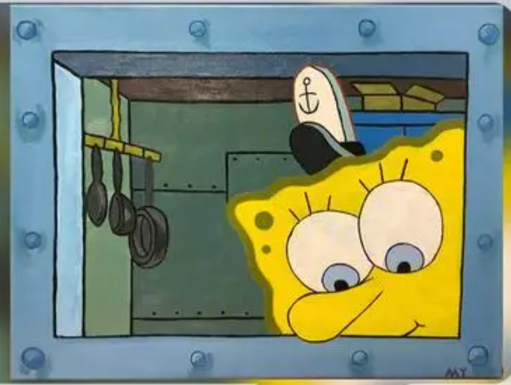

process
# 1st day
## 1.download vs 2022,and use the tool called spy++ which is in the vs.
## 2.you can use spy++ to check windows' handle.

wanted result
## topic：海绵宝宝
## 连接蟹堡王章鱼哥工作的收银台和海绵宝宝厨房的那个窗口作为壁纸的整个框架，如下图
<picture>
  <source media="(prefers-color-scheme: dark)" srcset="images/image.png">
  <source media="(prefers-color-scheme: light)" srcset="images/image.png">
  
</picture>

  ## 在左下角加上一个铃铛，用鼠标与这个铃铛互动的时候，铃铛会左右摇晃,海绵宝宝端着一盘蟹黄堡出来，只有一个手端着盘子，然后章鱼哥从窗外接走。一个互动结束。
  ## 鼠标悬停在桌面的任意处，会有泡泡的特效，
  ## 可以做一些在厨房里的互动，比如点击一下墙上的厨具，会掉下来，海绵宝宝会把它捡起来
  ## 会随着时间变化而变化，主要分为早上，晚上和傍晚，其余时间，在早上，是菠萝屋的窗口，通过窗口看见海绵宝宝在睡觉，专场就用泡泡飘上去转成在工作的那个窗口，然后，在傍晚蟹堡王灯亮起来，晚上，通过菠萝屋可以看到海绵宝宝在睡觉。

